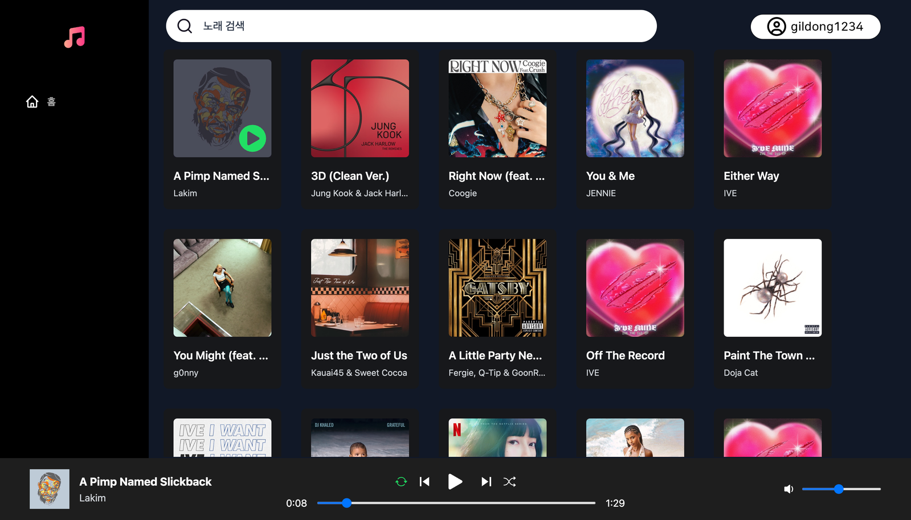

# Music Player

Spotify 클론 코딩 프로젝트 - 음악 스트리밍 사이트

## Tech Stack

### Frontend

### Backend

## Features

- 노래 추천
- 노래 검색
- 노래 재생 플레이어

## Screenshots

## Authors

- [@son-daehyeon](https://www.github.com/son-daehyeon)

## Acknowledgements

- [Spotify Web API](https://developer.spotify.com/documentation/web-api/)
- [Youtube Data API](https://developers.google.com/youtube/v3)
